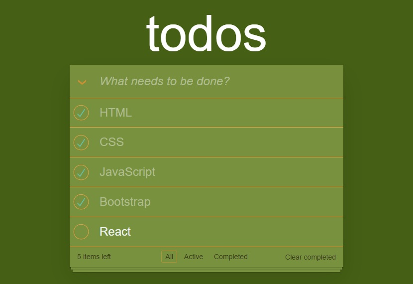

# todos_with_react-patika
Patika.dev React Task 2
todos with React 
Prop drilling in React 17 involves using arrays to store data in local storage for the todos task

[Patika.dev Academy](https://academy.patika.dev/tr "Öğrenme yolculuğuna başla")

